# Spotify Song Analysis


Dieses Projekt analysiert einen Spotify-Datensatz mit **550.622 Songs** und ihren Audio-Features mithilfe von Python und scikit-learn.
Ziel ist es, Muster in Musikdaten sichtbar zu machen und maschinelles Lernen einzusetzen, um Popularität vorherzusagen und Genres zu klassifizieren.

---

## Datensatz

| Eigenschaft | Wert |
|---|---|
| Quelle | Spotify Web API (via Kaggle) |
| Songs | 550.622 |
| Features | 21 Spalten |
| Zeitraum | 1900 – 2025 |
| Fehlende Werte | < 0,01 % |

**Audio-Features:** `danceability`, `energy`, `loudness`, `speechiness`, `acousticness`, `instrumentalness`, `liveness`, `valence`, `tempo`  
**Metadaten:** `name`, `artists`, `album_name`, `genre`, `year`, `popularity`, `total_artist_followers`, `avg_artist_popularity`

---

## Projektstruktur

```
├── data/
│   └── songs.csv
├── database/
│   └── spotify.db          ← generierte SQLite-Datenbank
├── outputs/
│   └── *.png               ← alle Grafiken
├── src/
│   ├── 00_csv_to_db.py
│   ├── 01_explore.py
│   ├── 02_regression.py
│   └── 03_classification.py
└── README.md
```

---

## Lokal ausführen

```bash
pip install scikit-learn pandas numpy matplotlib seaborn
python src/00_csv_to_db.py
python src/01_explore.py
python src/02_regression.py
python src/03_classification.py
```

---

## Schritt 0 – CSV → SQLite

Die rohe CSV-Datei wird eingelesen und in eine SQLite-Datenbank überführt. Dabei wird die `lyrics`-Spalte weggelassen, da sie für die Audio-Analyse irrelevant ist und die Dateigröße um ~80 % reduziert. Alle weiteren Schritte lesen ausschließlich aus der Datenbank.

---

## Schritt 1 – Exploration & Visualisierung

### Popularitätsverteilung & Top-Genres

<p align="center">
  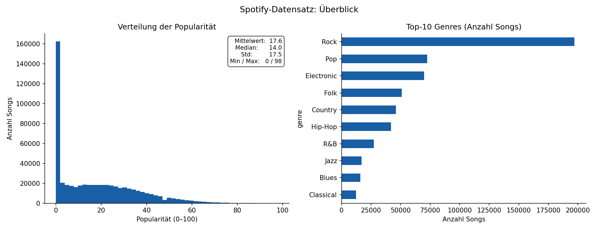
</p>

Die Popularität ist stark rechtsschief verteilt: Der Mittelwert liegt bei 17,6, der Median bei nur 14 – und 27 % aller Songs haben einen Wert von exakt 0. Das spiegelt die Realität auf Spotify wider, wo nur ein kleiner Bruchteil der Tracks nennenswerte Reichweite erzielt. Rock dominiert den Datensatz mit knapp 197.000 Einträgen und ist damit doppelt so häufig vertreten wie Pop (72.500). Die starke Genre-Ungleichverteilung ist ein wichtiger Faktor, den Klassifikationsmodelle in Schritt 3 berücksichtigen müssen.

---

### Verteilung der Audio-Features

<p align="center">
  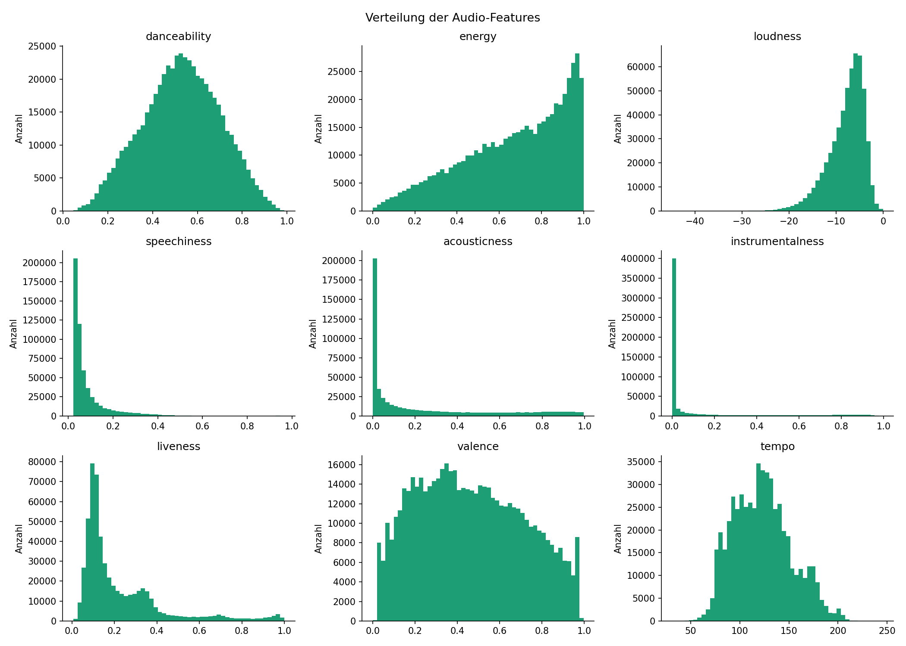
</p>

Die meisten Audio-Features bewegen sich im normierten Bereich von 0 bis 1. `Instrumentalness` und `speechiness` sind extrem rechtsskewed – die große Mehrheit der Songs hat wenig Instrumentalpassagen und kaum gesprochenes Wort. `Danceability`, `energy` und `valence` folgen annähernd einer Normalverteilung, was sie zu stabilen Features für Machine-Learning-Modelle macht. `Loudness` liegt typischerweise zwischen −20 und 0 dB und zeigt, dass moderne Produktionstechniken Songs deutlich lauter als ältere Aufnahmen machen.

---

### Korrelationsmatrix

<p align="center">
  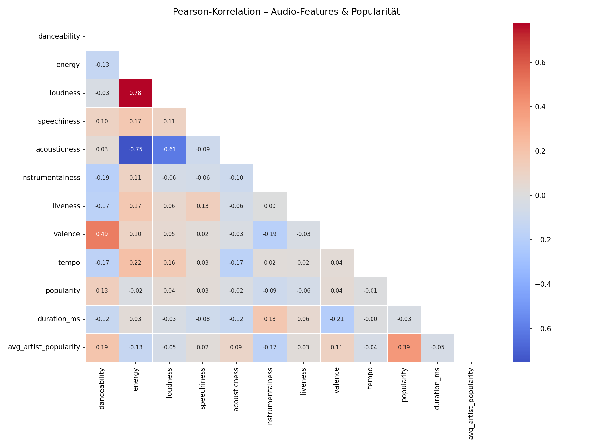
</p>

Die stärkste Korrelation im Datensatz besteht zwischen `energy` und `loudness` (r = 0,78): lautere Songs werden konsistent als energiereicher eingestuft. Ebenso stark ist der negative Zusammenhang zwischen `acousticness` und `energy` (r = −0,75) – akustische Songs sind naturgemäß ruhiger und weniger intensiv. Für die Popularitätsvorhersage ist `avg_artist_popularity` mit r = 0,39 der stärkste Prädiktor, gefolgt von `total_artist_followers` (r = 0,23) und `danceability` (r = 0,13). Reine Audio-Features haben also einen geringeren Einfluss auf den Erfolg als der bereits etablierte Bekanntheitsgrad des Künstlers.

---

### Popularität nach Genre

<p align="center">
  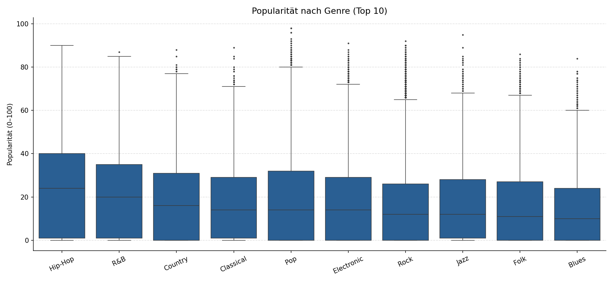
</p>

Die Boxplots zeigen deutliche Unterschiede in der Popularitätsverteilung zwischen den Genres. Pop und Hip-Hop tendieren zu höheren Medianwerten, während Jazz, Classical und Blues viele Songs mit Popularität nahe 0 aufweisen. Die Interquartilsabstände sind in allen Genres groß – selbst innerhalb eines Genres gibt es sowohl absolute Hits als auch vollständig ungehörte Tracks. Das macht Genre allein zu einem schwachen Prädiktor für Popularität.

---

### Popularität über die Jahre

<p align="center">
  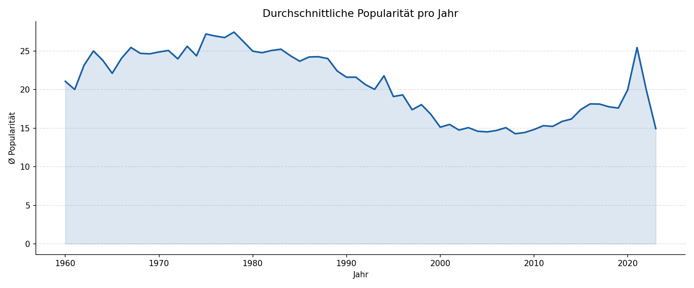
</p>

Die durchschnittliche Popularität steigt mit dem Erscheinungsjahr deutlich an. Ältere Songs aus den 1960er und 1970er Jahren haben auf Spotify strukturell niedrigere Werte, weil der Algorithmus aktuelle Hördaten bevorzugt und ältere Tracks seltener empfohlen werden. Songs ab 2015 zeigen die höchsten Durchschnittswerte – hier spielt auch der Effekt mit, dass neuere Releases zu Beginn algorithmisch gepusht werden. Dieses Muster ist bei der Regressionsmodellierung wichtig: `year` sollte als Feature aufgenommen werden, auch wenn seine Popularitätskorrelation mit r = −0,07 gering erscheint.

---

## Schritt 2 – Regression

Ziel: Die **Popularität** (0–100) eines Songs vorhersagen. Verglichen werden zwei Modelle mit unterschiedlicher Merkmalsbasis.

| Modell | Features | MAE | R² | Laufzeit |
|---|---|---|---|---|
| Lineare Regression | `year`, `is_rock` | 14,56 | 0,0095 | 0,030 s |
| SGD Regressor | 13 Features (Audio + Artist) | 12,79 | 0,1663 | 2,798 s |

### Modellvergleich

<p align="center">
  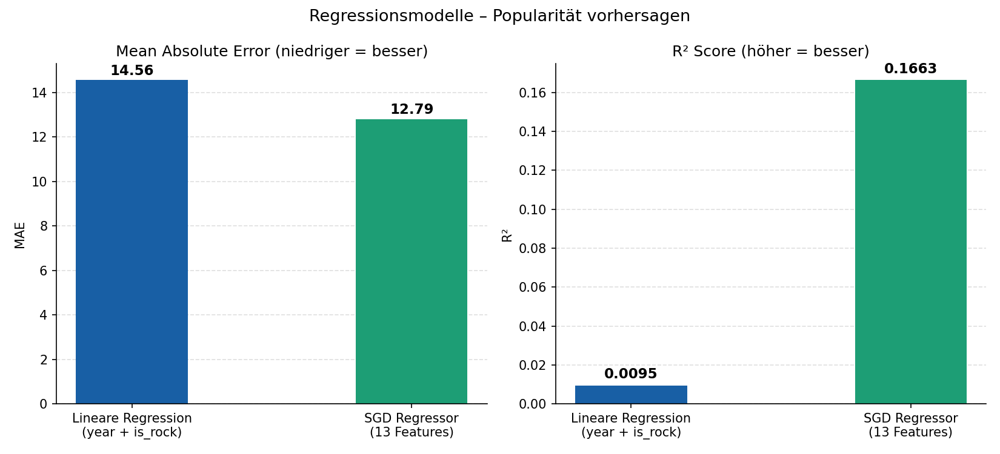
</p>

Die lineare Regression mit nur zwei Merkmalen (`year` und `is_rock`) liefert erwartungsgemäß schwache Ergebnisse: Ein R² von 0,0095 bedeutet, dass das Modell weniger als 1 % der Varianz in der Popularität erklärt. Der SGD Regressor mit 13 Features – darunter alle Audio-Features sowie `avg_artist_popularity` und `total_artist_followers` – verbessert den MAE von 14,56 auf 12,79 und erreicht ein R² von 0,167. Das zeigt, dass Audio-Merkmale allein die Popularität nur begrenzt erklären können; der Bekanntheitsgrad des Künstlers ist der dominierende Faktor.

---

### Vorhergesagt vs. Tatsächlich

<p align="center">
  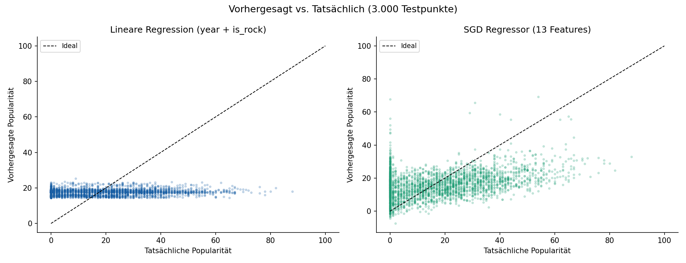
</p>

Der Streuplot zeigt die Schwäche beider Modelle deutlich: Die Vorhersagen streuen stark um die Ideallinie und tendieren zur Mitte des Wertebereichs. Sehr populäre Songs (Werte über 70) werden systematisch unterschätzt, Songs mit Popularität 0 werden überschätzt. Das liegt an der stark schiefen Zielverteilung – 27 % der Songs haben Popularität 0. Der SGD Regressor zeigt eine etwas bessere Streuung um die Diagonale, bleibt aber ebenfalls weit von einer präzisen Vorhersage entfernt. Für bessere Ergebnisse wären Ensemble-Methoden wie Random Forest oder Gradient Boosting nötig.

---

### Feature-Gewichte des SGD Regressors

<p align="center">
  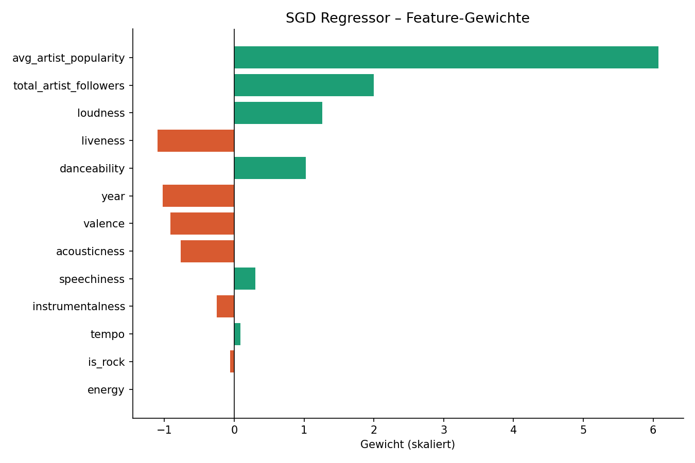
</p>

Die Feature-Gewichte des SGD Regressors bestätigen die Korrelationsanalyse aus Schritt 1: `avg_artist_popularity` hat mit Abstand den größten positiven Einfluss auf die vorhergesagte Popularität. `instrumentalness` wirkt sich negativ aus – rein instrumentale Songs erzielen im Schnitt geringere Popularitätswerte. `year` hat ein negatives Gewicht, was zunächst überraschend wirkt, aber durch den Recency-Bias in den Rohdaten relativiert wird. Audio-Features wie `danceability`, `energy` und `valence` haben moderate positive Gewichte.

---

## Schritt 3 – Classification

Ziel: Das **Genre** eines Songs aus seinen Audio-Features vorhersagen. Verwendet werden die Top-8-Genres (522.473 Songs). Da Rock mit ~38 % stark überrepräsentiert ist, wird `class_weight="balanced"` eingesetzt.

| Modell | Accuracy | F1 (weighted) | Laufzeit |
|---|---|---|---|
| LinearSVC | 0,4852 | 0,4422 | 15,18 s |
| SGD Classifier | 0,4685 | 0,4378 | 3,80 s |

### Modellvergleich

<p align="center">
  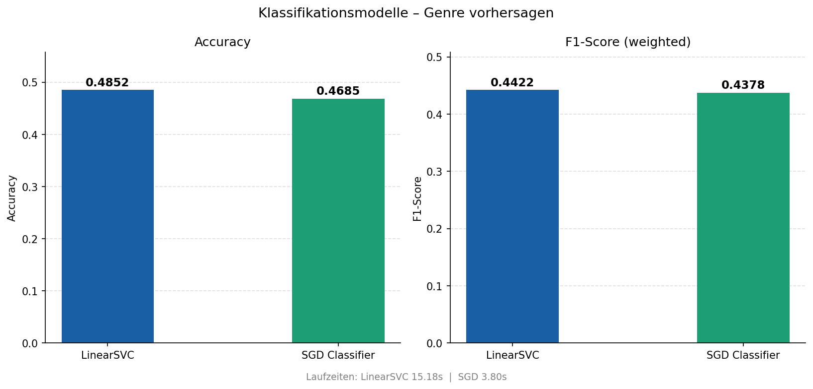
</p>

Beide Modelle erreichen eine Accuracy von knapp unter 50 % – deutlich über dem Zufallsniveau (12,5 % bei 8 gleichverteilten Klassen), aber ein klares Zeichen, dass Genre aus Audio-Features allein schwer zu unterscheiden ist. LinearSVC übertrifft den SGD Classifier leicht bei Accuracy (48,5 % vs. 46,9 %), benötigt dafür aber mit 15,2 s rund viermal so lang. Der SGD Classifier ist mit 3,8 s die deutlich effizientere Wahl, wenn Geschwindigkeit wichtiger ist als maximale Genauigkeit.

---

### Konfusionsmatrizen

<p align="center">
  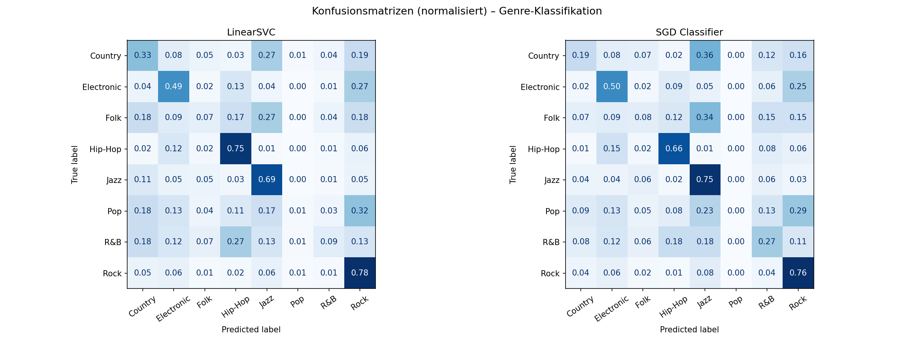
</p>

Die Konfusionsmatrizen zeigen, wo die Modelle systematisch scheitern: Rock wird am häufigsten mit Folk und Country verwechselt, was musikalisch naheliegend ist – diese Genres teilen oft ähnliche Tempo- und Akustik-Werte. Electronic wird dagegen vergleichsweise gut erkannt, da es sich durch hohe Energie und niedrige Acousticness klar abgrenzt. R&B und Hip-Hop werden häufig gegenseitig verwechselt, was auf ihre Audio-Feature-Ähnlichkeit hindeutet. Jazz wird von beiden Modellen am schlechtesten klassifiziert und oft als Folk oder Country fehlklassifiziert.

---

### F1-Score pro Genre

<p align="center">
  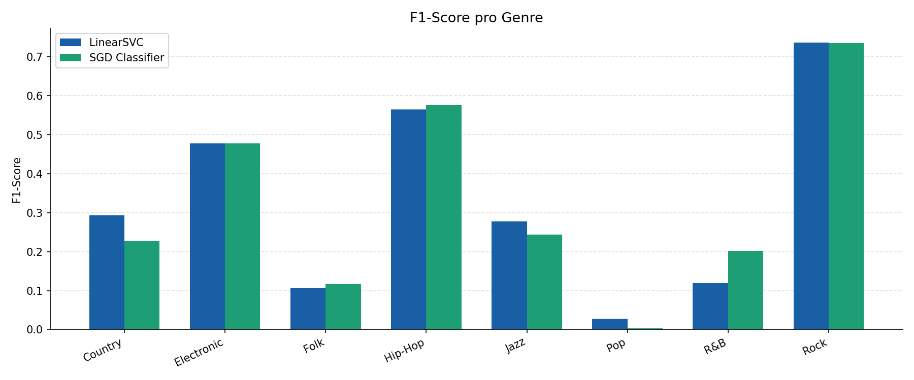
</p>

Der genreweise F1-Score macht die Unterschiede noch klarer: Electronic erzielt den höchsten F1 bei beiden Modellen, da seine Audio-Charakteristik einzigartig ist. Rock hat trotz starker Präsenz im Datensatz einen mittelmäßigen F1 – die schiere Menge an Rock-Songs bedeutet auch mehr interne Variation. R&B und Jazz bilden das Schlusslicht, was auf große Überlappungen mit anderen Genres in den Feature-Räumen hindeutet. Insgesamt bestätigt das Ergebnis, dass Genre kein rein akustisches Konzept ist – Kontext, Lyrics und kulturelle Faktoren spielen eine ebenso große Rolle.

---

## Fazit

| Aufgabe | Bestes Modell | Kernergebnis |
|---|---|---|
| Popularität vorhersagen | SGD Regressor | R² = 0,17 – Künstler-Popularität schlägt Audio-Features |
| Genre klassifizieren | LinearSVC | 48,5 % Accuracy – Electronic am besten trennbar |

Der zentrale Befund dieses Projekts: **Audio-Features allein erklären weder Popularität noch Genre vollständig.** Der Bekanntheitsgrad des Künstlers ist für die Popularitätsvorhersage entscheidender als der Sound des Songs. Bei der Genre-Klassifikation zeigt sich, dass viele Genres im Audio-Raum stark überlappen – besonders Rock, Folk und Country. Für deutlich bessere Modellgüte wären Lyrics-Embeddings, Playlist-Kontext oder Ensemble-Methoden (Random Forest, Gradient Boosting) der nächste sinnvolle Schritt.
