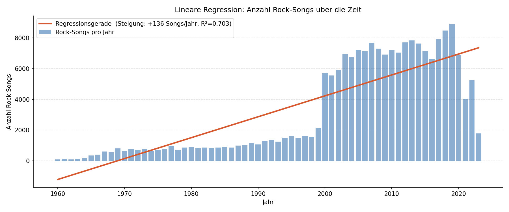

# Spotify Song Analysis

Dieses Projekt analysiert einen Spotify-Datensatz mit **550.622 Songs** und ihren Audio-Features mithilfe von Python und scikit-learn.
Ziel ist es, dass ich lerne, wie man auch mit großen Datensätzen umgeht, aber auch wie man Ergebnisse interpretiert. Bei meinem ersten Projekt (https://github.com/wittlhmz/audio_analysis) hatte ich einen sehr kleinen Datensatz und zudem waren die Erkenntnisse nicht besonders spannend.

---

## Datensatz

| Eigenschaft | Wert |
|---|---|
| Quelle | Spotify Web API (via Kaggle) |
| Songs | 550.622 |
| Features | 21 Spalten |
| Zeitraum | 1900 – 2025 |
| Fehlende Werte | < 0,01 % |

**Audio-Features:** `danceability`, `energy`, `loudness`, `speechiness`, `acousticness`, `instrumentalness`, `liveness`, `valence`, `tempo`  
**Metadaten:** `name`, `artists`, `album_name`, `genre`, `year`, `popularity`, `total_artist_followers`, `avg_artist_popularity`

Zunächst habe ich bei diesem Datensatz die `lyrics`-Spalte weggelassen, da die Songtexte für meine Analyse irrelevant waren und die Dateigröße der Datenbank damit um ca. 80% reduziert wurde.

---

## Exploration & Visualisierung

Bei einem so großen Datensatz macht es Sinn, dass man sich erstmal mit dem Datensatz vertraut macht und ein paar Verteilungen visualisiert, im Folgenden sind einige mehr oder weniger interessante Fakten visualisiert.

### Popularitätsverteilung & Top-Genres

  

Die Popularität ist stark rechtsschief verteilt: Der Mittelwert liegt bei 17,6, der Median bei nur 14 – und 27 % aller Songs haben einen Wert von exakt 0. Das spiegelt eben auch die Realität wider, wo nur ein kleiner Bruchteil der Tracks nennenswerte Reichweite erzielt. Rock dominiert den Datensatz mit knapp 197.000 Einträgen und ist damit doppelt so häufig vertreten wie Pop (72.500). 

---

### Verteilung der Audio-Features

  

Die meisten Audio-Features bewegen sich im normierten Bereich von 0 bis 1. Dass die `Energy` so hoch ist, liegt vermutlich daran, dass so vilee Rock-Songs vertreten sind. Die `Loudness` ist vor allem zwischen −10 und -4 dB, was absolut normal ist bei den meisten Songs auf Spotify. Beim `Tempo` fällt auf, dass eigentlich alle Stufen mal vertreten sind, die meisten Lieder sind im Bereich 115-130 BPM.

---

### Korrelationsmatrix

  

Die stärkste Korrelation im Datensatz besteht zwischen `energy` und `loudness` (r = 0,78): lautere Songs werden konsistent als energiereicher eingestuft. Ebenso stark ist der negative Zusammenhang zwischen `acousticness` und `energy` (r = −0,75). Akustische Songs sind naturgemäß ruhiger und weniger intensiv. Für die Popularitätsvorhersage ist `avg_artist_popularity` mit r = 0,39 der stärkste Prädiktor, gefolgt von `total_artist_followers` (r = 0,23) und `danceability` (r = 0,13). Reine Audio-Features haben also einen geringeren Einfluss auf den Erfolg als der bereits etablierte Bekanntheitsgrad des Künstlers.

---

### Popularität nach Genre

  

Die Boxplots zeigen deutliche Unterschiede in der Popularitätsverteilung zwischen den Genres. Pop und Hip-Hop tendieren zu höheren Medianwerten, während Jazz, Classical und Blues viele Songs mit Popularität nahe 0 aufweisen. Die Interquartilsabstände sind in allen Genres groß; selbst innerhalb eines Genres gibt es sowohl absolute Hits als auch vollständig ungehörte Tracks. Das macht Genre allein zu einem schwachen Prädiktor für Popularität.

---

## Regression

In meinem anderen Datenprojekt hätte es kaum Sinn gemacht auf die Regression einzugehen, weil die Daten sehr wenige Features hatten, die dann zum Teil auch wenig Aussagekraft haben.

| SGD Regressor | 13 Features (Audio + Artist) | 12,79 | 0,1663 | 2,798 s |

### Lineare Regression - Rock-Songs über die Zeit

  

Die Regressionsgerade zeigt, dass die Anzahl an Rock-Songs im Datensatz über die Jahrzehnte stark zugenommen hat. Von wenigen hundert Einträgen in den 1960ern bis zu mehreren tausend pro Jahr ab den 2000ern. Das R² der Trendlinie liegt bei 0,72, was auf einen klar linearen Wachstumstrend hindeutet. Ab etwa 2010 flacht die Kurve leicht ab, was auf eine Sättigung im Rock-Segment oder eine veränderte Genrestruktur im Datensatz hindeuten kann. Die Steigung der Geraden lässt sich direkt aus dem Regressionskoeffizienten ablesen: Pro Jahr kommen im Schnitt mehrere hundert Rock-Songs hinzu.
Insgesamt sollte man bei einer solchen Datenverteilung aber nicht mit einer Regressionsgerade arbeiten, da die Unterschiede zwischen manchen Jahren wirklich extrem groß sind (von 1999 auf 2000 kamen 4000 Songs hinzu), was die Vorhersage erschwert.
Laufzeit: 0,030 s

---

### SGD Regressor – Feature-Gewichte

  

Ich habe zudem den SGD Regressor verwendet, um zu schauen, welche Features den größten Einfluss auf die Popularität von Liedern hat.
Die Feature-Gewichte bestätigen die Korrelationsanalyse aus der Exploration: `avg_artist_popularity` hat mit Abstand den größten positiven Einfluss auf die vorhergesagte Popularität, sodass der Bekanntheitsgrad des Künstlers alle Audio-Merkmale schlägt. `instrumentalness` wirkt sich negativ aus, rein instrumentale Songs erzielen im Schnitt geringere Popularitätswerte. Audio-Features wie `danceability`, `energy` und `valence` haben moderate positive Gewichte.

---

## Classification

Ziel: Das **Genre** eines Songs aus seinen Audio-Features vorhersagen. Verwendet werden die Top-8-Genres (522.473 Songs). Da Rock mit ~38 % stark überrepräsentiert ist, wird `class_weight="balanced"` eingesetzt.

| Modell | Accuracy | F1 (weighted) | Laufzeit |
|---|---|---|---|
| LinearSVC | 0,4852 | 0,4422 | 15,18 s |
| SGD Classifier | 0,4685 | 0,4378 | 3,80 s |

### LinearSVC – Modellvergleich

  

Beide Modelle erreichen eine Accuracy von knapp unter 50 %, was erfreulich ist, da es deutlich über dem Zufallsniveau liegt (12,5 % bei 8 gleichverteilten Klassen), aber es ist auch ein klares Zeichen, dass das Genre aus Audio-Features allein nur schwer zu unterscheiden ist. LinearSVC übertrifft den SGD Classifier leicht bei der Genauigkeit (48,5 % vs. 46,9 %), benötigt dafür aber mit 15,2 s rund viermal so lang. 

---

### Konfusionsmatrizen

  

Die Konfusionsmatrizen zeigen, wo die Modelle scheitern. Rock wird am häufigsten mit Folk und Country verwechselt, was musikalisch naheliegend ist, da diese Genres sich oft ähnliche Tempo- und Akustik-Werte teilen. Electronic wird dagegen vergleichsweise gut erkannt, da es sich durch hohe Energie und niedrige Acousticness klar abgrenzt. R&B und Hip-Hop werden häufig gegenseitig verwechselt, was auf ihre Audio-Feature-Ähnlichkeit hindeutet. Jazz wird von beiden Modellen am schlechtesten klassifiziert und oft als Folk oder Country fehlklassifiziert.

Insgesamt funktioniert die Klassifizierung in diesem Projekt schon weitaus besser, als in meinem 1. Projekt, da der Datensatz einfach besser ist.
